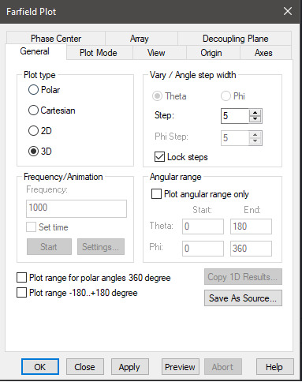
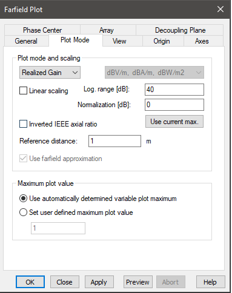
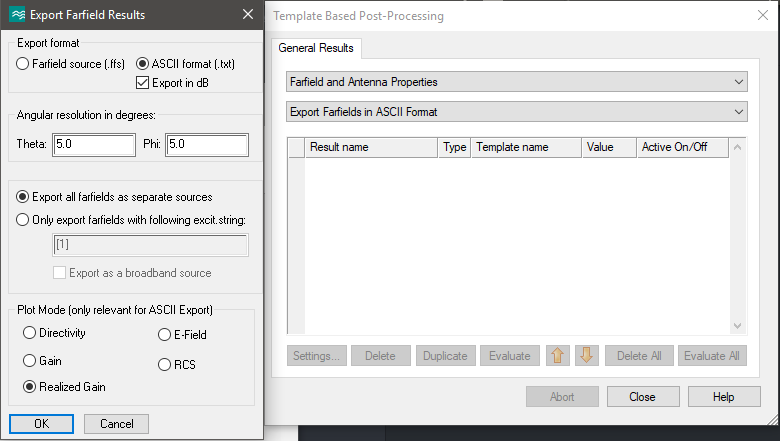
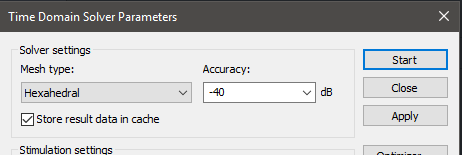

.. _sec_cst_settings:

********************************************
Required settings when working with CST
********************************************

When using the tool to process CST pattern one needs to set it up first. Most of the settings described here are default CST but will be repeated here in case some project needed to change them.

.. _sec_example_dipole:

Example dipole
==============================

To illustrate this a simple dipole simulation in CST will be used and the lenght of the dipole will be varied. The example file can be found in the package repository.

It is important to use frequency units set to **MHz** or **GHz**. This will become important when determining the pattern frequency automatically on import.

.. note::
    Use frequency units set to MHz for antenna patterns. The python library will assume MHz if the values in the exported file names are >100 and it will assume GHz if the values are <100. This means that if the frequency units are set to MHz and the exported pattern is at 60MHz there will be an import mistake.

.. _sec_rad_pat_plot:

Configuring the radiation patterns plots
===========================================
The plotting options in CST have to be configured for the default IEEE coordiantes as described in [1].

[1] IEEE Standard Test Procedures for Antennas," in ANSI/IEEE Std 149-1979 , vol., no.,pp.0_1-, 1979
**doi** : 10.1109/IEEESTD.1979.120310
**keywords** : {antennas;electronic equipment testing;measurement standards;IEEE standard;test procedures;antenna properties;ANSI/IEEE Std 149-1965;radiation patterns;antenna range;antenna test facilities; instrumentation; Antennas; Electronic equipment testing; Measurement standards}
**URL**: http://ieeexplore.ieee.org/stamp/stamp.jsp?tp=&arnumber=19510&isnumber=768

This means spehrical coordinate system where the Theta angle is defined from 0 to 180 degrees and the Phi angle is defined from 0 to 360 degrees. This is configured as shown in :numref:`fig_farfield_plot_general`.

.. _fig_farfield_plot_general:

    Setting for the default IEEE coordinate system.

The plot mode must be set to realized gain since the python module ONLY works with this import type. This is illustrated in :numref:`fig_farfield_plot_plot_mode`.

.. _fig_farfield_plot_plot_mode:

    Settings for realized gain.

The scale can be both linear or logarithmic. Other settings like axis definitions and values ranges can be freely selected.

Patterns configured in this way can be exported using the template based post processing - settings shown in :numref:`fig_pattern_export`.

.. _fig_pattern_export:

    Settings for template based post processing export.

It is important to mark the Realized gain option and the ASCII format as TXT. The scale can be both linear or logarithmic and the port selection is also free.

With CST configured as described above the python library can be used directly.

To use the parametric sweep the simulation must be run with the Store result data in cache flag as shown in :numref:`fig_store_cache`.

.. _fig_store_cache:

    Use store cache flag to store the patterns from each parametric sweep.

See the example usage script for demonstration of each of these.
